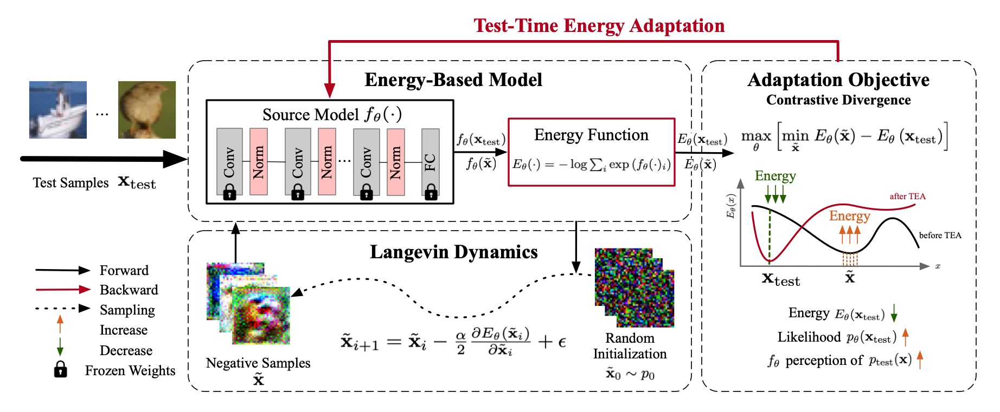

# TEA: Test-time Energy Adaptation

> Yige Yuan, Bingbing Xu, Liang Hou, Fei Sun, Huawei Shen, Xueqi Cheng
> 
> The IEEE / CVF Computer Vision and Pattern Recognition Conference (CVPR), 2024

This is an official PyTorch implementation of paper [TEA: Test-time Energy Adaptation](https://arxiv.org/abs/2311.14402).



### Main Usage

```python
CUDA_VISIBLE_DEVICES=0 python main.py --cfg cfgs/cifar10/energy.yaml
```
The default model using trained WRN-28-10 from [RobustBench](https://github.com/RobustBench/robustbench).

*core/config.py* defines all default settings, you can specify particular settings in *cfgs/xx.yaml*

### Baseline Support

Our code supports running other baselines with a one-line script, the supported baselines include:
- **Source:** model without any adaptation
- **PL:** Pseudo-Label-The Simple and Efficient Semi-Supervised Learning Method for Deep Neural Networks (ICMLW 2013)
- **SHOT:** Do We Really Need to Access the Source Data? Source Hypothesis Transfer for Unsupervised Domain Adaptation (ICML 2020)
- **BN**: Improving robustness against common corruptions by covariate shift adaptation (NeurIPS 2020)
- **TENT:** Tent: Fully Test-Time Adaptation by Entropy Minimization (ICLR 2021)
- **ETA:** Efficient Test-Time Model Adaptation without Forgetting (ICML 2022)
- **EATA:** Efficient Test-Time Model Adaptation without Forgetting (ICML 2022)
- **SAR:** Towards Stable Test-time Adaptation in Dynamic Wild World (ICLR 2023)

```python
# Baselines
CUDA_VISIBLE_DEVICES=0 python main.py --cfg cfgs/cifar10/source.yaml
CUDA_VISIBLE_DEVICES=0 python main.py --cfg cfgs/cifar10/norm.yaml
CUDA_VISIBLE_DEVICES=0 python main.py --cfg cfgs/cifar10/tent.yaml
CUDA_VISIBLE_DEVICES=0 python main.py --cfg cfgs/cifar10/eta.yaml
CUDA_VISIBLE_DEVICES=0 python main.py --cfg cfgs/cifar10/eata.yaml
CUDA_VISIBLE_DEVICES=0 python main.py --cfg cfgs/cifar10/sar.yaml
CUDA_VISIBLE_DEVICES=0 python main.py --cfg cfgs/cifar10/pl.yaml
CUDA_VISIBLE_DEVICES=0 python main.py --cfg cfgs/cifar10/shot.yaml
```

### Reference
If you find our work useful, please consider citing our paper:
```
@article{yuan2023tea,
  title={TEA: Test-time Energy Adaptation},
  author={Yuan, Yige and Xu, Bingbing and Hou, Liang and Sun, Fei and Shen, Huawei and Cheng, Xueqi},
  journal={arXiv preprint arXiv:2311.14402},
  year={2023}
}
```
